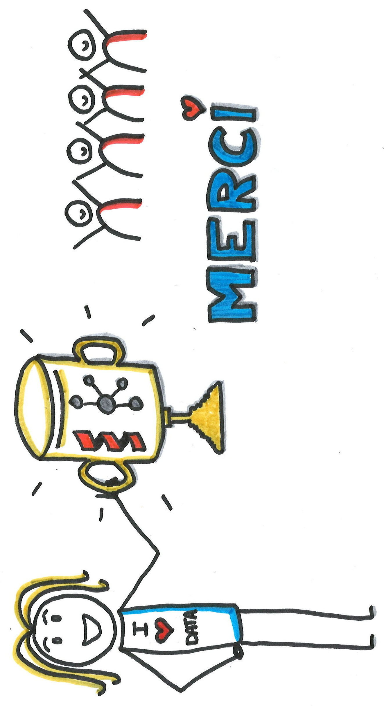

= +++ +++
:title-slide-background-image: images/dompter-data-background.jpg
:icons: font

== Il y a 2 ans

image:images/3dinge.jpg[width=300]

== Aujourd'hui

image:images/datainge.jpg[width=250]

== 3D

image:images/home-by-me.png[width=500]

== Kafka

image:images/monde_data1-3.jpg[width=500]

== La perte de vitesse

image:images/perteVitesse.jpg[width=750]

== Réussir sa reconversion

== Parcours atypique

image:images/agilite.jpg[width=700]

// Il y a deux ans, j’étais développeuse C++, et j’ai fait le choix d’entamer une reconversion pour apprendre à dompter la Data et devenir Ingénieure Data.
//
// Pour passer d’un univers à un autre, monter en compétence a été une étape, mais me sentir légitime a été une épreuve.
//
// Comment passe-t-on du développement d'applications 3D à la gestion d'une pipeline de données Kafka ? D'un outil de génération de cuisines automatiques pour Ikea à l'ingestion de milliers de données sous Snowflake ?
//
// Qu'est-ce qui m'a fait sauter le pas pour sortir de ma zone de confort ? Comment j’ai réussi à gérer mes doutes, à faire des choix cornéliens, et à traverser les moments difficiles ?
//
// Dans ce retour d'expérience, je vais d’abord partager avec vous mon parcours à travers les maths, la 3D et la Data. Je vous parlerais des moyens utilisés pour me former à la Data, et la place essentielle de la cohésion d’équipe dans ma reconversion.
//
// Je vous donnerai ensuite les astuces et les indispensables pour réussir à vous lancer dans une reconversion, et vous découvrirez qu’un choix de parcours atypique pourra vous apporter beaucoup plus que des compétences techniques (adaptation au changement, confiance en soi ...).
// Nous verrons enfin comment améliorer l’intégration des profils en reconversion et ainsi favoriser leur inclusion dans votre entreprise.
