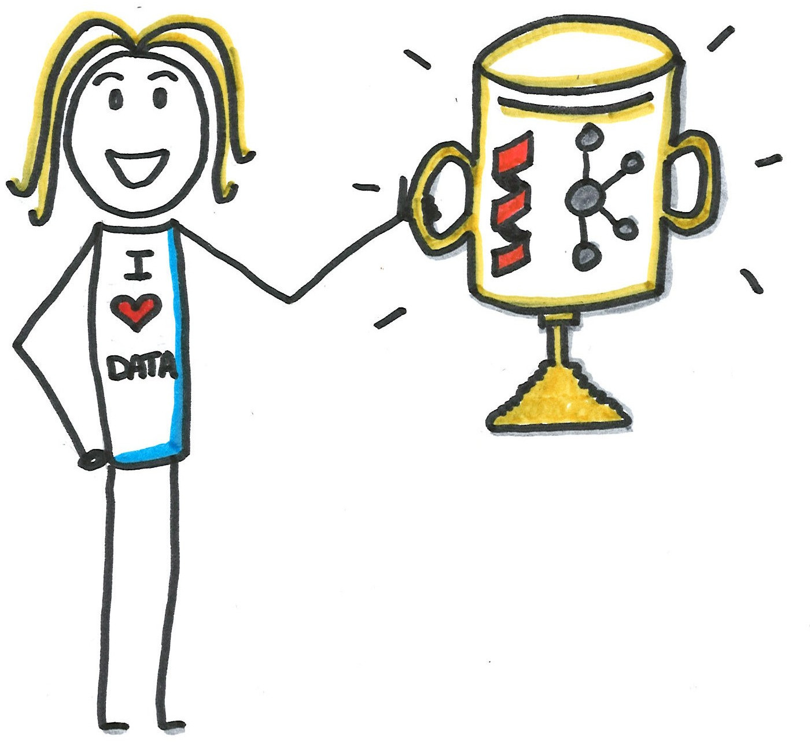
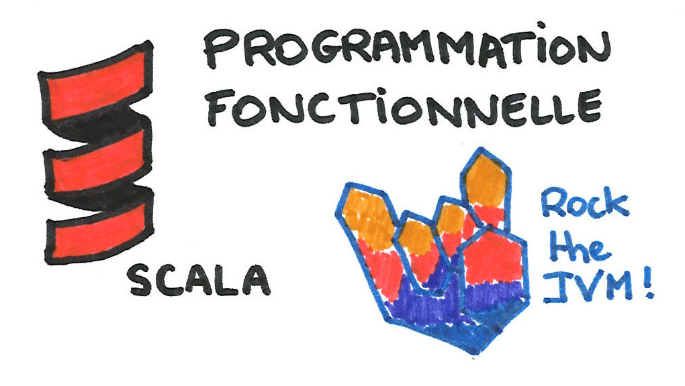
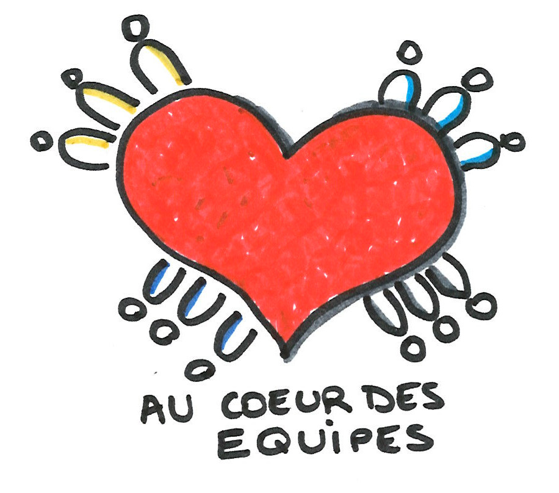

= +++ +++
:title-slide-background-image: images/dompter-data-background.jpg
:source-highlighter: highlightjs
:highlightjs-languages: scala
:icons: font

== How I met Data ?

ifeval::[{duration} == 'long']
== Enfance

endif::[]

== Professeurs

Sketch

== 🎓 INSA Génie Mathématique - 2008-2013

//
// *
// * 💻 *C++*, Modélisation *3D*, Shaders OpenGL, Optimisation
// * 🧪 4 expériences dans la 3D...

== Dassault Systèmes - 2012

[.columns]
=== La simulation de tissus

[.column]
video::videos/collisionTissu.mp4[width = 500, height = 500]

[.column]
Maillage 3D +
+ +
forces physiques +
image:images/tissuForce1.jpg[width=140]
image:images/tissuForce2.jpg[width=180]

== Dassault Systèmes - 2013

image:images/home-by-me.png[width = 500]

[.columns]
=== L'aménagement automatique de cuisines

[.column]
image:images/cuisok.png[width=800]

[.column]
image:images/pso.jpg[width=700]

[.columns]
== Thermo Fisher - 2016

[.column]
image:images/avizo3D.png[]

[.column]
C++, Qt, Cuda +
Shaders OpenGL +
Git

== Lectra - 2019

image:images/Modaris3D.jpg[]

// == Motivation pour ce talk
//
// * 🧪 *Retour d'expérience* sur ma reconversion dans la Data
// * ⚖️ Les *doutes*, les choix difficiles, les difficultés
// * 📖 Les *conseils* et les clés pour réussir sa reconversion
// * 🫵 Vous donner *envie* de vous lancer !
// * 🔑 Comment *accueillir* une nouvelle recrue issue d'une reconversion ?

// == Le monde de la 3D et de la modélisation mathématique

=== Le monde de la 3D

* 📐 Des *maths* appliquées
* 👩‍💻 *Algorithmie* poussée
* 📉 Recherche de perf (optimisation, calcul distribué)
* 👗 Projets intéressants, beaucoup de fonctionnel
* 🇩🇪 *Conférence* C++ à Berlin
* 👩‍🔬 *Expertise* C++

=== La perte de vitesse - 2021

image:images/perteVitesse.jpg[width=750]

== Besoin de changement !

todo

== Choix difficiles

image:images/changement.jpg[width=800]

=== L'entretien d'embauche

image:images/entretien.jpg[width=550]

=== Premières difficultés

* 💵 Déception côté salaire
** Plan de montée en compétence
* ⌚ 3 mois d'attente
** 💻 Demande accès formations

== 💺 Ingénieure *Data*

[.columns]
=== Lectra - 2021

[.column]
image:images/vector.png[width=500]

=== Enrichissement et collecte de données

=== Pipelines de données à gérer dans Kafka = Tuyaux

image:images/monde_data1-3.jpg[width=500]

// [.column]
// * 💺 Ingénieure *Data*
// * 💻 *Scala*, *Kafka*, Spark, *Snowflake*, Databricks, Docker, Kubernetes
// * 📊 Données de machines de découpe de tissus

=== Programmation fonctionnelle (Scala)

=== Exemple Scala

[source, scala]
----

val intList = new ArrayList[Int]()
for (i <- 1 to 5) {
  intList.add(i)
}

val oddNoList = new ArrayList[Int]()
for (i <- 0 until intList.size) {
  if (intList.get(i) % 2 == 1) oddNoList.add(intList.get(i))
}

val squareList = new ArrayList[Int]()
for (i <- 0 until oddNoList.size) {
  squareList.add(oddNoList.get(i) * oddNoList.get(i))
}

var sum = 0
for (i <- 0 until squareList.size()) {
  sum += squareList.get(i)
}
System.out.println("Sum : " + sum)
----

=== Exemple Scala

[source, scala]
----
val pow2 = (x: Int) => x * x
val functionalResult = (1 to 5).filter(_ % 2 == 1).map(pow2).sum
println("Sum : "+functionalResult)
----

=== Multitude de petits projets

=== Au cœur des équipes

=== Kubernetes, Docker, Jenkins

=== Mise en production

=== Automatisation, Qualité, Analyses

image:images/monde_data2-4.jpg[width=500]

=== Fonctionnel des données

=== Challenges

Sketch

* migration sql server à snowflake
* découper les kpi par jour et shift
* données temps réel

== Formation

image:images/data.jpg[width=500]

=== Auto formation

[%step]
* 💻 En ligne
* 🗣️ Interne
* 🕵️‍♀️ Espionner ses collègues
* 🚵‍♀️ Essayer et *se tromper*

=== Auto formation

[%step]
* 🗣️ "Pourquoi ?" "Comment ?"
* 🍻 *Partager*
* 🎤 Assister à des *Conférences*

=== Une équipe au top

image:images/my-team.png[width=500]

=== Une équipe au top

[%step]
* 🧸 Parrain
* 📖 *Documentation*
* ✏️ Schémas
* 🧑🏼‍🤝‍🧑🏻 *Mob*
* 🍻 Coding dojos
* 🫶 *Soutien et bienveillance*

== Les clés pour réussir sa reconversion

[%step]
* 🐣 Accepter de repartir de zéro, apprentissage long
* 🎁 Accepter d'apporter moins à l'équipe que ce qu'elle te donne
* 🙋‍♀️ Oser dire "je n'ai pas compris"
* 😞 Accepter les doutes
* 🤗 Savourer les petites victoires

=== Les doutes et moments difficiles 😞

* Je me sens nulle !
* Retour de vacances : Je ne comprends plus rien !
* Je suis un boulet pour l'équipe
* J'ai toujours pas compris c'est quoi une Monad (Scala)
* Besoin de reconnaissance de la part de son employeur

=== Les petites victoires 🤗

* Partage sur ce que je connais : la 3D, Git, le karaoké 🎁
* Première maîtrise de petites parties du code 🏆
* Premières propositions d'idées pertinentes 💡
* Première conférence 😉
* Je suis sortie de ma zone de confort 💪

=== Devenir légitime

* Confiance en soi, combattre le syndrôme de l'imposteur 🤥️
* Lien de confiance avec son équipe 🤝
* Lien de confiance avec son entreprise 🥇

=== Agilité et innovation

image:images/agilite.jpg[width=700]
// * Atout pour l'équipe
// * Diversité des profils
// * Pousser l'équipe à se challenger
// * Idées disruptives
// * Ouverture au changement
// * Motivation et détermination
// * Soft skills, qualités humaines

// == De nouvelles envies
//
// * Data Science, statistiques, analyses
// * Découvrir de nouveaux outils, technos
// * Donner des formations pour aider les petits nouveaux
// * Donner des conférences sur des sujets Data

== Et vous ? Vous vous lancez ?

=== Conseils

* Bien choisir son équipe et son chef
* Bien négocier les *conditions* du poste (salaire, temps de formation, titre de poste)
* Avancer petit à petit
* Se faire financer une formation externe, diplômante

=== Se reconvertir dans un nouveau domaine ?

* C'est normal en fait ! Etat d'esprit, adaptation 🤔
* N’ayez pas *peur* de vous lancer, et argumentez vos choix de parcours honnêtement
* Pouvez-vous *évoluer* en interne, discutez-en !
* Osez *postuler* à des postes qui ne vous correspondent pas à l'instant t
* Stages, formations CPF, et *vis ma vie*

=== Le rôle de l'entreprise

* Acceptez les profils issus de la reconversion, favoriser l’*inclusion* de profils atypiques
* Soyez *ouvert* dans vos descriptions de poste
** Soft skills
* Donnez le *temps* à l'équipe de former les nouveaux
* Donnez le *temps* et les *moyens* aux reconverti(e)s de se former
* Apprenez des *différences* et des expériences

== Merci beaucoup !

image:images/merci.jpg[width=700]

icon:github[] https://jvauchel.github.io/

