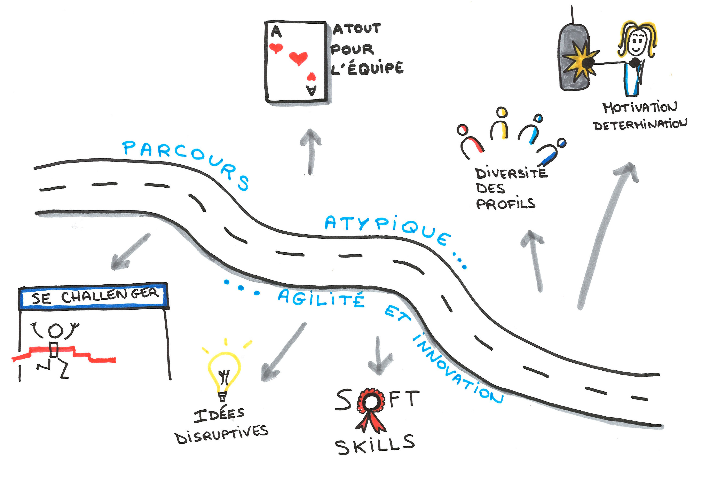

= +++ +++
:title-slide-background-image: images/dompter-data-background.jpg
:icons: font

== Présentation

[.columns]
=== Aujourd'hui

[.column]
image:images/datainge.jpg[width=250]

[.column]
* 💺 Ingénieure *Data* chez https://www.lectra.com/fr[Lectra] - 2021
* 💻 *Scala*, *Kafka*, Spark, *Snowflake*, Databricks, Docker, Kubernetes
* 📊 Données de machines de découpe de tissus

[.columns]
=== Parcours

[.column]
image:images/3dinge.jpg[]

[.column]
* 🎓 INSA Génie Mathématique - 2013
* 💻 *C++*, Modélisation *3D*, Shaders OpenGL, Optimisation
* 🧪 4 expériences dans la 3D...

=== Dassault Systèmes - 2012

image:images/home-by-me.png[width = 500]

=== Thermo Fisher - 2016

image:images/avizo3D.png[]

=== Lectra - 2019

image:images/Modaris3D.jpg[]

== Motivation pour ce talk

* 🧪 *Retour d'expérience* sur ma reconversion dans la Data
* ⚖️ Les *doutes*, les choix difficiles, les difficultés
* 📖 Les *conseils* et les clés pour réussir sa reconversion
* 🫵 Vous donner *envie* de vous lancer !
* 🔑 Comment *accueillir* une nouvelle recrue issue d'une reconversion ?

== Le monde de la 3D et de la modélisation mathématique

[.columns]
=== La simulation de tissus

[.column]
video::videos/collisionTissu.mp4[width = 500, height = 500]

[.column]
Equations différentielles en chaque nœud du maillage pour modéliser les *forces physiques* d'un tissu. +
image:images/tissuForce1.jpg[width=140]
image:images/tissuForce2.jpg[width=180]

[.columns]
=== L'aménagement automatique de cuisines

[.column]
image:images/cuisok.png[width=800]

[.column]
Comment modéliser les *contraintes* d'aménagement d'une cuisine en une fonction de plusieurs variables à minimiser ?

=== Le monde de la 3D

* 📐 Des *maths* appliquées
* 👩‍💻 *Algorithmie* poussée
* 📉 Recherche de perf (optimisation, calcul distribué)
* 👗 Projets intéressants, beaucoup de fonctionnel
* 🇩🇪 *Conférence* C++ à Berlin
* 👩‍🔬 *Expertise* C++

=== La perte de vitesse

image:images/perteVitesse.jpg[width=750]

== Besoin de changement !

image:images/changement.jpg[width=800]

=== L'entretien d'embauche

image:images/entretien.jpg[width=550]

=== Travailler sa légitimité

. Confiance en soi, combattre le syndrôme de l'imposteur 🤥️
. Lien de confiance avec son équipe 🤝
. Lien de confiance avec son entreprise 🥇
** Objectif : Cartographie montée en compétence technique

== Le monde de la Data

=== Programmation fonctionnelle (Scala)

image:images/monde_data1-1.jpg[width=500]

=== Pipelines de données à gérer dans Kafka = Tuyaux

image:images/monde_data1-3.jpg[width=500]

=== Multitude de petits projets

image:images/monde_data1-2.jpg[width=500]

=== Etre au cœur des équipes

image:images/monde_data1-4.jpg[width=500]

=== Kubernetes, Docker, Jenkins

image:images/monde_data2-1.jpg[width=500]

=== Mise en production rapide et continue

image:images/monde_data2-2.jpg[width=500]

=== Automatisation, recherche de qualité, analyses

=== Fonctionnel : Métier des données qu'on manipule

image:images/monde_data2-3.jpg[width=500]

=== Auto formation

* 💻 *Formations* en ligne (Udemy, Documentation en ligne des technos, tutos)
* 🗣️ Formations internes
* 🕵️‍♀️ Regarder les *commits* des collègues tous les jours
* 🚵‍♀️ Se lancer et *se tromper*, essayer seule avant de demander

=== Auto formation

* 🗣️ Donner son *avis*, poser des *questions*, demander de réexpliquer
* 🍻 *Partager* ce qu’on a appris
** Projet d'exemple : kafka-stream-example
* 🎤 Assister à des *Conférences*

=== Une équipe au top

image:images/my-team.png[width=500]

=== Une équipe au top

* 🧸 Accompagnement de toute l’équipe et attribution d’un parrain
* 📖 *Documentation riche*, lisible, à jour
* ✏️ Nombreux schémas
* 🧑🏼‍🤝‍🧑🏻 *Mob* et pair-programming
* 🍻 Coding dojos, *sharing session*
* 🫶 L'essentiel : *Soutien et bienveillance*

== Les clés pour réussir sa reconversion

* 🐣 Accepter de repartir de zéro, apprentissage long
* 🎁 Accepter d'apporter moins à l'équipe que ce qu'elle te donne
* 🙋‍♀️ Oser dire "je n'ai pas compris"
* 😞 Accepter les doutes
* 🤗 Savourer les petites victoires

=== Les doutes et moments difficiles 😞

* Je me sens nulle !
* Retour de vacances : Je ne comprends plus rien !
* Je suis un boulet pour l'équipe
* J'ai toujours pas compris c'est quoi une Monad (Scala)
* Besoin de reconnaissance de la part de son employeur

=== Les petites victoires 🤗

* Partage sur ce que je connais : la 3D, Git, le karaoké 🎁
* Première maîtrise de petites parties du code 🏆
* Premières propositions d'idées pertinentes 💡
* Première conférence 😉
* Je suis sortie de ma zone de confort 💪

=== Agilité et innovation

// * Atout pour l'équipe
// * Diversité des profils
// * Pousser l'équipe à se challenger
// * Idées disruptives
// * Ouverture au changement
// * Motivation et détermination
// * Soft skills, qualités humaines

// == De nouvelles envies
//
// * Data Science, statistiques, analyses
// * Découvrir de nouveaux outils, technos
// * Donner des formations pour aider les petits nouveaux
// * Donner des conférences sur des sujets Data

== Et vous ? Vous vous lancez ?

=== Conseils

* Bien choisir son équipe et son chef
* Bien négocier les *conditions* du poste (salaire, temps de formation, titre de poste)
* Avancer petit à petit
* Se faire financer une formation externe, diplômante

=== Se reconvertir dans un nouveau domaine ?

* C'est normal en fait ! Etat d'esprit, adaptation 🤔
* N’ayez pas *peur* de vous lancer, et argumentez vos choix de parcours honnêtement
* Pouvez-vous *évoluer* en interne, discutez-en !
* Osez *postuler* à des postes qui ne vous correspondent pas à l'instant t
* Stages, formations CPF, et *vis ma vie*

=== Le rôle de l'entreprise

* Acceptez les profils issus de la reconversion, favoriser l’*inclusion* de profils atypiques
* Soyez *ouvert* dans vos descriptions de poste
** Soft skills
* Donnez le *temps* à l'équipe de former les nouveaux
* Donnez le *temps* et les *moyens* aux reconverti(e)s de se former
* Apprenez des *différences* et des expériences

== Merci beaucoup !

image:images/merci.jpg[width=700]

icon:github[] https://jvauchel.github.io/

