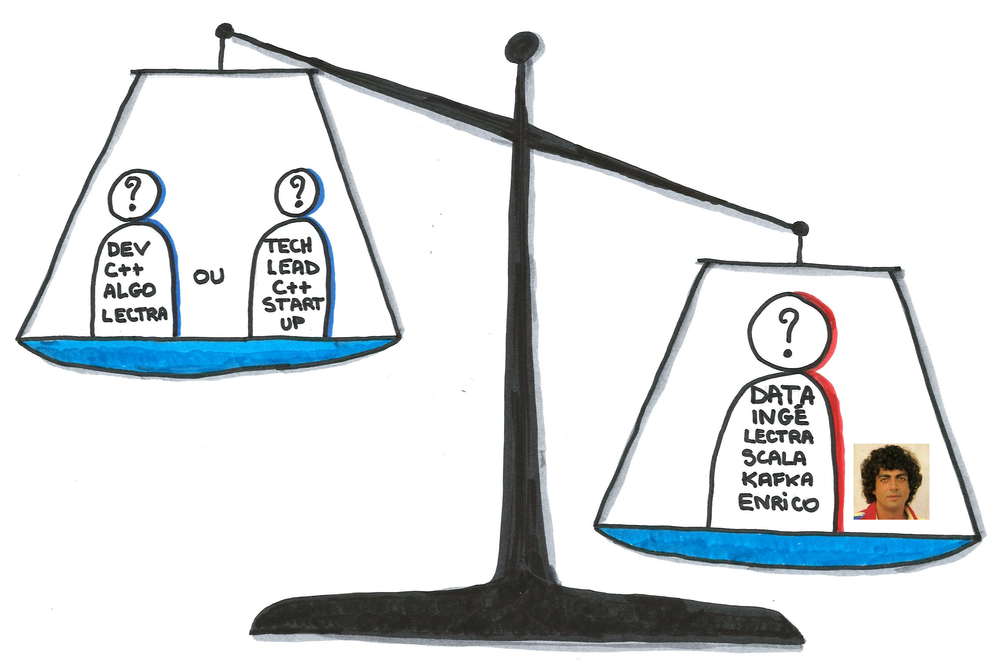

= +++ +++
:title-slide-background-image: images/dompter-data-background.jpg

== Présentation

[.columns]
=== Aujourd'hui

[.column]
image:images/datainge.jpg[width=250]

[.column]
* Ingénieure Data chez Lectra
* Technos : Scala, Kafka, Spark, Snowflake, Databricks, Docker, Kubernetes

// Je suis aujourd'hui ingénieure Data où je gère une pipeline de données en provenance de machines de découpe de tissus.
//J'utilise dans mon quotidien les technos comme Scala, Kafka, Spark, Snowflake

[.columns]
=== Parcours

[.column]
image:images/3dinge.jpg[]

[.column]
* Génie Mathématique
* C++, Modélisation 3D, Shaders OpenGL, Optimisation
* 3 expériences dans la 3D...

// Mais je n'ai pas toujours fait de la Data. J'ai une formation plutôt orientée Mathématiques Appliquées et j'ai commencé à travailler sur des applications 3D, codées en C++

=== Dassault Systèmes

image:images/home-by-me.png[width = 500]

//J'ai commencé chez Dassault Systèmes où j'ai développé un moteur de génération de cuisine automatique

=== Thermo Fisher

image:images/avizo3D.png[]
// Ensuite j'ai travaillé sur un logiciel de reconstruction 3D à partir d'images provenant de microscopes

=== Lectra

image:images/Modaris3D.jpg[]
// Et j'ai travaillé dans la simulation de tissus pour des logiciels de création de vêtements en 3D

== Motivation pour ce talk

* *Retour d'expérience* sur ma reconversion dans la Data
* Les *doutes*, les choix difficiles, les difficultés
* Les *conseils* et les clés pour réussir sa reconversion
* Vous donner *envie* de vous lancer !
* Comment *accueillir* une nouvelle recrue issue d'une reconversion ?

== Le monde de la 3D et de la modélisation mathématique

[.columns]
=== La simu de tissus

[.column]
video::videos/collisionTissu.mp4[width = 500, height = 500]

[.column]
Equations différentielles en chaque noeud du maillage pour modéliser les forces physiques d'un tissu. +
// Savez-vous que pour modéliser la robe de la reine des neige en 3D par exemple, on utilise un maillage et on applique des forces physiques sur chaque point du maillage. C'est comme si chaque point était relié entre eux par des ressorts avec plus ou moins d'intensité selon le type de tissu.
image:images/tissuForce1.jpg[width=140]
image:images/tissuForce2.jpg[width=180]

[.columns]
=== L'aménagement automatique de cuisines

[.column]
image:images/cuisok.png[width=800]

[.column]
Comment modéliser les contraintes d'aménagement d'une cuisine en une fonction de plusieurs variables à minimiser ?

=== Le monde de la 3D

* Des maths appliquées
* Algorithmie poussée
* Recherche de perf (optimisation, calcul distribué)
* Projets intéressants, beaucoup de fonctionnel
* Conférence C++ à Berlin
* Expertise C++

== La perte de vitesse

// * Quand on perd le fun du début
// * Besoin d’évoluer, d’apprendre
// * POC 3D dans le cloud => envie de découvrir de nouvelles technos
// * Manque de reconnaissance dans mon travail, mal-être
// * Pas assez de maths et de 3D à mon goût dans mon quotidien

== Besoin de changement !

//Des opportunités en C++ :

// * Poste C++ et algorithmie : intéressant !
// * Poste de tech lead C++ : promotion !

//Cool promotion, mieux payé, nouveau statut.
//C++, je reste dans mes pantoufles
//Qu’est ce que je vais apprendre ? Je suis curieuse de voir d’autres techno  !
//Doutes, envie d’apprendre plus grande, mais peur de recommencer à zero

// == Pourquoi la reconversion Data
//
// * Je n'aime pas le Front !
// * J'ai pas peur des données (grosses matrices)
// * J'aime l'abstrait
// * Lien avec les stats et les modèles mathématiques via la data science
// *

== L'entretien d'embauche :

Travailler sa légitimité !

//

//Bonjour, j’y connais rien mais je suis très motivée :) et en plus je veux bien une augmentation :)
//Le domaine de la Data est très vaste, et je pense pouvoir reconnecter avec les maths si j’en ressens le besoin, même si là maintenant c’est plus une soif de technos (Scala, Kafka, Spark, Snowflake)
//Ko côté reconnaissance salariale: J’aurais dû mieux argumenter. Quand on est dev, on peut tout apprendre, et il est normal d’évoluer et de réapprendre de zero de nouvelles techno, ça fait partie de notre quotidien.

== Le monde de la Data (1/2)

* Programmation fonctionnelle (Scala)
* Pipelines de données à gérer dans Kafka = Tuyaux
* Multitude de petits projets
* Etre au coeur des équipes

=== Le monde de la Data (2/2)

* Kubernetes, Docker, Jenkins
* Mise en production rapide et continue
* Fonctionnel : Métier des données qu'on manipule
* Amélioration continue, automatisation, recherche de qualité, analyses

=== Auto formation

// J’ai la casquette mais pas les bagages, comment se former ?
* Formations en ligne (Udemy, Documentation en ligne des technos, tutos), Formations internes
* Regarder les commits des collègues tous les jours
* Se lancer et se tromper
* Donner son avis, poser des questions, demander de réexpliquer
* Partager ce qu’on a appris
** projet d'exemple : kafka-stream-example

//Formation en ligne sur udemy : Scala, Spark
//Ils m’ont formé à Kafka, au fonctionnel, beaucoup de documentations et de schémas

=== Une équipe au top

* Accompagnement de toute l’équipe et attribution d’un parrain
* Documentation riche, lisible, à jour
* Nombreux schémas
* Mob et pair-programming
* Coding dojos, sharing session
* Conférences
* L'essentiel : Soutien et bienveillance

//Ils m’ont formé à Kafka, au fonctionnel, beaucoup de documentations et de schémas

== Les clés pour réussir sa reconversion

* Accepter de repartir de zero, apprentissage long
* Accepter d'apporter moins à l'équipe que ce qu'elle te donne
* Oser dire "je n'ai pas compris"
* Accepter les doutes
* Savourer les petites victoires

=== Les doutes et moments difficiles

// Certaines journées où on se trouve nulle
// Retour de vacances où on comprend plus rien
// On se dit qu'on est un boulet pour l'équipe, qu'on la ralentit
// Quand on a toujours pas compris c'est quoi une monad (Scala)
//
// Partage sur ce que je connais : la 3D, Git, le karaoke
// Quand on commence à maîtriser des petites parties
// Quand on commence à proposer des idées pertinentes => Les petites victoires.
* Je me sens nulle !
* Retour de vacances : Je comprends plus rien !
* Je suis un boulet pour l'équipe
* J'ai toujours pas compris c'est quoi une Monad (Scala)
* Salaire qui ne suit pas

=== Les petites victoires

* Partage sur ce que je connais : la 3D, Git, le karaoké
* Première maîtrise de petites parties du code
* Premières propositions d'idées pertinentes

=== Conseils

* Bien choisir son équipe et son chef
* Bien négocier les conditions du poste (salaire, temps de formation, titre de poste)
* Avancer petit à petit
* Se faire financer une formation externe, diplomante

== Ce que j’ai gagné

== De nouvelles envies

== Et vous ? Vous vous lancez ?

=== Accueil de reconverti(e)s

* Acceptez les profils issus de la reconversion, favoriser l’inclusion
* Soyez ouvert dans vos titres et descriptions de poste
* Donnez le temps à l'équipe de former les débutant(e)s
* Donnez le temps et les moyens aux reconverti(e)s de se former
* Apprenez des différences et des expériences des autres

=== Se reconvertir dans un nouveau domaine ?

* N’ayez pas peur de vous lancer, et argumentez vos choix de parcours honnêtement
* Pouvez-vous évoluer en interne, discutez-en !
* Osez postuler à des postes qui ne vous correspondent pas à l'instant t
* Stages et vis ma vie

== Merci !

// Point avec Fanny et Stéphane
// TADx: Tours Agile Devops Experience, sujets variés, tech, bien etre agile, team
// 30 min à 1h30 (40mn ok)
// 1 par mois le mardi, 2 dates dispo par mois
// Que moi, Questions/Reponses, Pizza, échanges, pas de stress de timing
//Octobre ou Novembre
//Co working possible la journée

// Questions : à quel point détailler les 2 mondes
// Parler des étapes à passe, des différences entre les 2 mondes, sacré changement d'univers
// Vulgarisation (car personnes diverse, agiliste, tech dev)
// Comprendre l'effort par l'exemple
//
// Dire quand je suis prête

